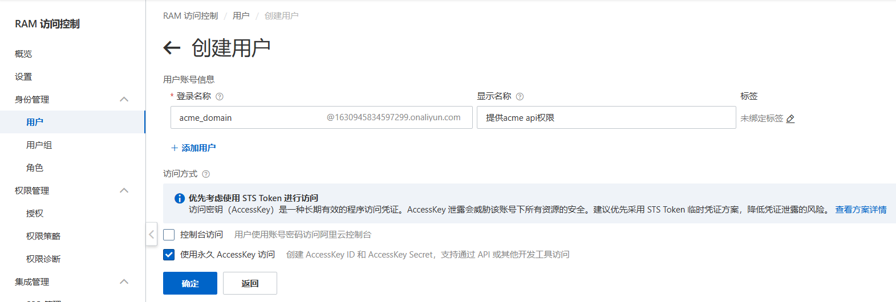

[toc]
# 0. 序言

​	使用nginx做反向代理, 使用https协议.

# 1. DNS原理

## 1.1 DNS结构组成, 例如www.example.com

​	其中www是二级域名, 表示主站, 其余值可以是email等; 

​	example是一级域名; 

​	com是顶级域名(其它值包括.edu, .org等); 

​	. 是根域名.

## 1.2 nslookup命令

将使用nslookup命令, 模拟DNS解析过程, 以解析www.bilibili.com域名

* 基本使用是输入nslookup www.bilibili.com

  返回

  ```bash
  / # nslookup www.bilibili.com
  Server:         192.168.65.7
  Address:        192.168.65.7:53
  
  Non-authoritative answer:
  www.bilibili.com        canonical name = a.w.bilicdn1.com
  Name:   a.w.bilicdn1.com
  Address: 221.15.71.67
  Name:   a.w.bilicdn1.com
  Address: 221.15.71.66
  Name:   a.w.bilicdn1.com
  Address: 61.240.206.12
  Name:   a.w.bilicdn1.com
  Address: 221.15.71.65
  ```

  其中Server是dns服务器域名或ip. Address则更详细. Non-authoritative answer表示缓存, canonical作用类似转发和散射.

* 获取权威的地址时, 先访问.服务器

  

* 利用根查询顶级服务器

  

* 利用顶级查询权威服务器

  

* 利用权威查询具体ip

  

# 2. 申请证书

## 2.1 前置, 域名申请

​	使用阿里云的域名注册服务, 一年10块, 注册的是.icu域(I see you). 只能说现在注册一个域名都需要挺多配置的.


## 2.2 使用acme获取和管理免费证书

acme Github页面: [GitHub - acmesh-official/acme.sh: A pure Unix shell script implementing ACME client protocol](https://github.com/acmesh-official/acme.sh?tab=readme-ov-file#3-install-the-issued-cert-to-apachenginx-etc)

一个好用的教程: [Debian服务器上使用ACME.SH脚本免费获取SSL泛域名证书并启用HTTPS加密 - 哔哩哔哩](https://www.bilibili.com/opus/642845849979715588)

1. apline镜像环境配置(安装gcc以及其他一些依赖)

   ```bash
   apk add gcc g++ make cmake gfortran libffi-dev openssl-dev libtool
   ```

2. 安装openssl

   openssl的安装需要使用gcc进行源码编译

   * 先下载安装包

     ```bash
     wget https://www.openssl.org/source/openssl-1.1.1h.tar.gz
     ```

   * 解压缩

     ```bash
     tar -zxvf openssl-1.1.1h.tar.gz
     ```

   * 编译

     ```bash
     cd openssl-1.1.1h
     make
     make install
     ```

   或是直接使用

   * 直接下载(适合下载新版)

     ```bash
     apk add openssl
     ```

     安装后提示如果要使用独立服务器（充当临时http服务器验证你的域名拥有权限）, 可以下载一个Socat工具.

3. 安装acme

   ```bash
   curl https://get.acme.sh | sh -s email=2284420557ljwgo@gmail.com
   ```

   安装结果, 可以在用户目录下找到命令脚本

   ```bash
   / # find / -name acme.sh
   /root/.acme.sh/acme.sh
   ```

   取个别名, 方便后续调用, 将它写入bashrc以持久化(多用于命令别名)

   ```bash
   alias acme.sh=/root/.acme.sh/acme.sh
   ```

   acme默认使用的是ZeroSSL.com CA

4. 使用acme指定域和存放路径

   有两种方式:

   * http方式, 这种方式可能要求CA可以访问到你域名下的http服务(默认80端口), 以验证你的权限.

   ```bash
   acme.sh --issue -d mydomain.com --webroot /home/wwwroot/mydomain.com/
   ```

   可以使用standalone模式, 让acme临时充当http服务器, 这样的好处是你不需要开发和部署出服务器, 但依旧需要公网ip,并且需要前面提到的Socat工具支持.

   * dns方式, 这种方式只需要存在dns的解析记录即可. 但根据博客介绍, 如果没有配置Automatic DNS API. acme无法自动更新证书, 每次都需要手动再次重新解析验证域名所有权。

   ```bash
   # 该配置项有问题, 如何修改请参考第3点
   acme.sh --issue --dns -d ljwgo.icu \
    --yes-I-know-dns-manual-mode-enough-go-ahead-please
   ```

   自动模式需要域名提供商有api支持, 它允许外部自动添加TXT解析记录到域名解析列表中, 更多的具体参考官方文档吧

   因此, 我们使用dns手动的方式, 有空再改为自动的.

   

   在阿里云控制台中添加对应的TXT解析记录, 证明域名的所有权即可.

   

   最后调用renew命令, 生成证书和私钥, 记得保存下来.

   ```bash
   acme.sh --renew --dns -d ljwgo.icu \
   --yes-I-know-dns-manual-mode-enough-go-ahead-please
   ```

   结果文件为

   ```bash
   [Mon Apr 28 16:09:20 UTC 2025] Your cert is in: /root/.acme.sh/ljwgo.icu_ecc/ljwgo.icu.cer
   [Mon Apr 28 16:09:20 UTC 2025] Your cert key is in: /root/.acme.sh/ljwgo.icu_ecc/ljwgo.icu.key
   [Mon Apr 28 16:09:20 UTC 2025] The intermediate CA cert is in: /root/.acme.sh/ljwgo.icu_ecc/ca.cer
   [Mon Apr 28 16:09:20 UTC 2025] And the full-chain cert is in: /root/.acme.sh/ljwgo.icu_ecc/fullchain.cer
   ```

5. 中间认证机构与证书链

   使用
   
   ```bash
   openssl s_client -connect mydomain.com:443
   ```
   
   查看证书链等信息
   
6. 使用证书

   不要直接移动或修改证书文件, 继续使用acme托管 (多个-d选项似乎只会处理第一个)

   ```bash
   # 请保证文件名称对应
   acme.sh --install-cert -d ljwgo.icu -d *.ljwgo.icu \
   --key-file       /etc/nginx/ssl/privkey.pem  \
   --fullchain-file /etc/nginx/ssl/fullchain.pem
   ```

   如果使用nginx, 为了应用证书, 请使用

   ```bash
   service nginx force-reload
   ```

   可以在--install-cert中使用--reloadcmd, 它可以在证书更新时自动调用,重启服务器以应用证书更新.

   可以使用

   ```bash
   acme.sh --upgrade --auto-upgrade
   ```

   自动更新acme.sh(随口说一下, 看到acme GitHub网页有1k issue, 有点慌)

7. 查看证书信息

   ```bash
   acme.sh --info -d example.com
   ```
   
8. 吊销证书

   ```bash
   acme.sh --revoke -d yourdomain.com
   ```
   
9. 为acme提供阿里云程序api

   为了在证书过期时可以自动更新, 需要向acme提供写入DNS解析文本的权限, 这就需要在阿里云提供openapi

   ```bash
   # ... (github安全不通过删掉了)
   ```
   
   创建访问密钥, 在acme创建证书时给出密钥即可. 如果要持久化, 记得写入到配置文件中 (如/etc/profile). 如果使用容器, 就好写入到Dockerfile中, 写入容器内的bashrc等文件, 配置可能会失效.
   
   ```bash
   # 声明环境变量 (github安全不通过删掉了)
   ```
   
   使用命令申请
   
   ```bash
   acme.sh --issue --dns dns_ali -d www.ljwgo.icu
   ```
   
   为了让AccessKey生效, 需要在阿里云中设置权限.
   
   * 首先创建一个ARM子用户, 为了区分主账号并分配不同权限. 这里使用AccessKey
   
   
   
   * 之后授予DNS权限
   
   
   
   * 调整多因素认证
   
     多因素认证指的是登录时, 除了账号密码, 还要使用手机号码, 邮箱等方式额外验证. 这个可能要关闭掉.
   
   
   
   * 当然也可以调整AccessKey应用的ip地址范围
   
   
   
   * 现在acme可以自动向DNS添加TXT解析记录了.

# 3. nginx配置ssl

​	好,现在可以配置nginx了.

## 3.1 配置

​	配置项如下:

```bash
error_log /usr/local/nginx/logs/error_nginx.log error;

server {
        ssl_session_cache       shared:SSL:10m;
        ssl_session_timeout     10m;

        listen                  443 ssl;
        server_name             www.ljwgo.icu;
        keepalive_timeout       70;

        ssl_certificate         /etc/nginx/ssl/fullchain.pem;
        ssl_certificate_key     /etc/nginx/ssl/privkey.pem;
        ssl_protocols           TLSv1.2 TLSv1.3;
        ssl_ciphers             HIGH:!aNULL:!MD5;

        # The body max size send from client
        client_max_body_size    20M;

        location        /       {
                # root          /Software/nginx/test;
                # index         index.html;
                proxy_pass      http://192.168.195.167:3000;
                # 这些头的作用是告诉服务器真正的客户端的信息, 而不是nginx反向代理的信息.
                proxy_set_header Host $host;
                proxy_set_header X-Forwarded-Host $host;
                proxy_set_header X-Forwarded-Proto $scheme;
                proxy_set_header X-Real-IP $remote_addr;
                proxy_set_header X-Forwarded-For $proxy_add_x_forwarded_for;
        }
}

# redirect 80 http to 443 https
server {
        listen                  80;
        server_name             www.ljwgo.icu ljwgo.icu;
        return 301 https://$host$request_uri;
}
```

​	但是, 因为之前的证书只对ljwgo.icu进行签名, 所以当访问www.ljwgo.icu时会视为不合法的连接. 需要重新申请一个正确的证书. nginx文档中提到多域名匹配有多种方法. 以下:

1. 结合正则和多域名

   因为证书字符数有限, 因此能够添加的域名书有限 (具体来说时Subject Alternative Name字段) .

   但是正则表达式\*的问题是 \*.ljwgo.icu不能匹配跨级域名, 比如a.b.ljwgo.icu

   * 申请命令改为

   ```bash
   acme.sh --issue --dns -d *.ljwgo.icu \
    --yes-I-know-dns-manual-mode-enough-go-ahead-please
   ```

2. 使用多个证书, 并在nginx中分配它们

   由于ssl四次握手进行在http请求前(或是ssl不携带域名信息), ssl阶段不知道域名.

   ```nginx
   server {
       listen          443 ssl;
       server_name     www.example.com;
       ssl_certificate www.example.com.crt;
       #...
   }
   
   server {
       listen          443 ssl;
       server_name     www.example.org;
       ssl_certificate www.example.org.crt;
       #...
   }
   ```

   因此, 以下配置两个服务将均使用www.example.com.crt证书. 虽然有协议扩展解决了问题, 但目前似乎兼容性不好.

   解决方案是使用ip地址

   ```nginx
   server {
       listen          192.168.1.1:443 ssl;
       server_name     www.example.com;
       ssl_certificate www.example.com.crt;
       #...
   }
   
   server {
       listen          192.168.1.2:443 ssl;
       server_name     www.example.org;
       ssl_certificate www.example.org.crt;
       #...
   }
   ```

   ## 3.2 验证
   
   ​	在验证时, 记得
   
   * 容器需正确映射443, 80等端口
   * DNS服务器可以改为阿里云DNS服务器
